# Práctica Calificada 2
# **Parte 1: Algoritmos, Programación Orientada a Objetos**

1. Nos piden escribir una función que acepte una cadena que contenga todas las letras del alfabeto excepto una y devuelva la letra que falta.

    Implementamos la función find_missing_letter, como se nos pidio está función acepta la cadena con los requisitos requeridos.

    Parametros:
        - str: La cadena de entrada que falta una letra del alfabeto.
    Devuelve:
        - La letra que falta en la cadena.

    Ejemplo de uso:  
        `find_missing_letter` ("the quick brown box jumps over a lazy dog")  
        Devuelve "f"
    
    Realizamos nuestro código ruby en Jupyter Notebook y se puede observar que muestra la salida esperada.

    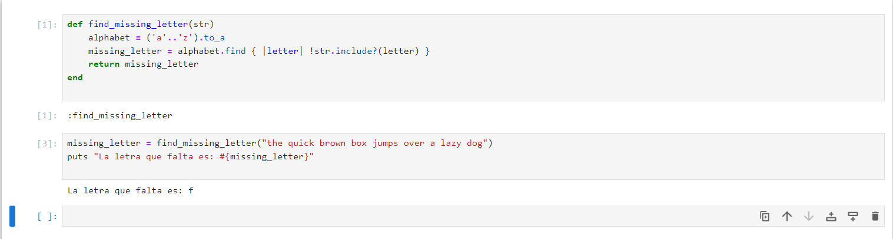

2. Nos piden definir una clase colección llamada BinaryTree que ofrezca los métodos de
instancia <<, empty? y each.

    - <<(element): Inserta un elemento en el árbol.
    - empty?: Verifica si el árbol está vacío.
    - each(&block): Realiza un recorrido inorden del árbol.

    *Ejemplo de uso:*   
    tree = BinaryTree.new(5)  
    tree << 3  
    tree << 7  
    tree.empty? # Devuelve false  

    Realizamos nuestro código ruby en Jupyter Notebook como se muestra a continuación, al ejecutarlo nos devuelve each?

    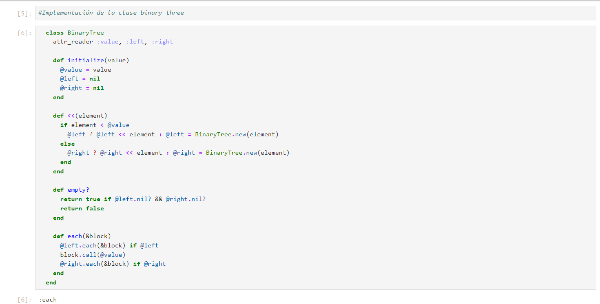

    Ahora escribimos el ejemplo de uso para comprobar si la función esta bien implementada, podemos observar que nos devuelve false, esto debido a que nuestro arbol no está vacio. 

    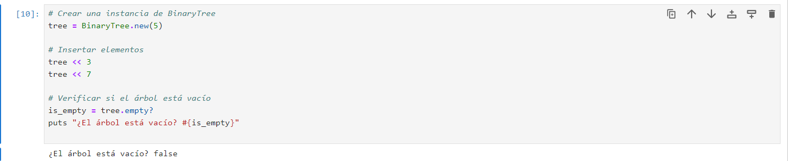

3. Nos piden extender nuestra clase BinaryTree para que ofrezca los siguientes métodos. 

    La clase BinaryTree se ha extendido con los siguientes métodos:
    - include?(elt): Verifica si el árbol incluye un elemento dado.
    - all?(&block): Verifica si un bloque es cierto para todos los elementos del árbol.
    - any?(&block): Verifica si un bloque es cierto para al menos un elemento del árbol.
    - sort: Ordena los elementos del árbol.

    *Ejemplo de uso:*  
    tree.include?(3) # Devuelve true  
    tree.all? { |value| value < 10 } # Devuelve true  
    tree.any? { |value| value > 10 } # Devuelve false  
    tree.sort # Devuelve [3, 5, 7]
    
    Realizamos nuestro código ruby en Jupyter Notebook como se muestra a continuación

    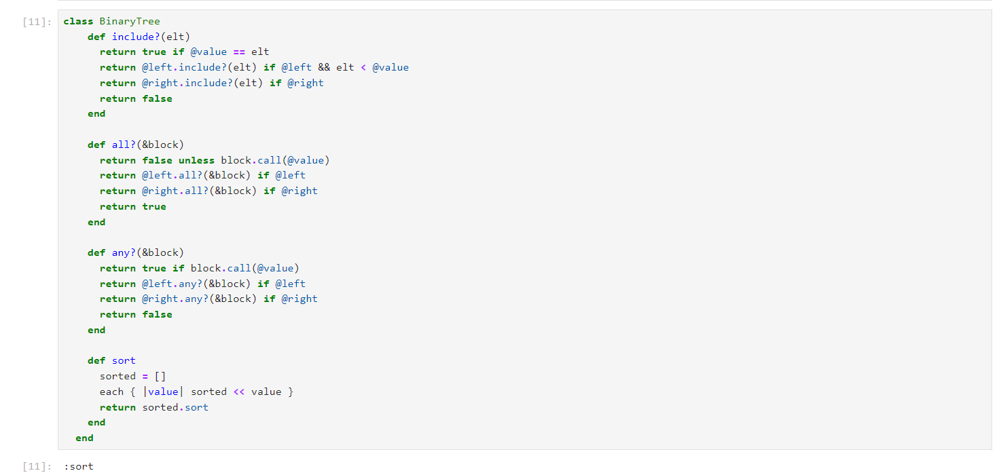

    Ahora escribimos el ejemplo de uso y lo ejecutamos, observamos que los resultados demuestran el funcionamiento de las funciones de la clase BinaryTree.

    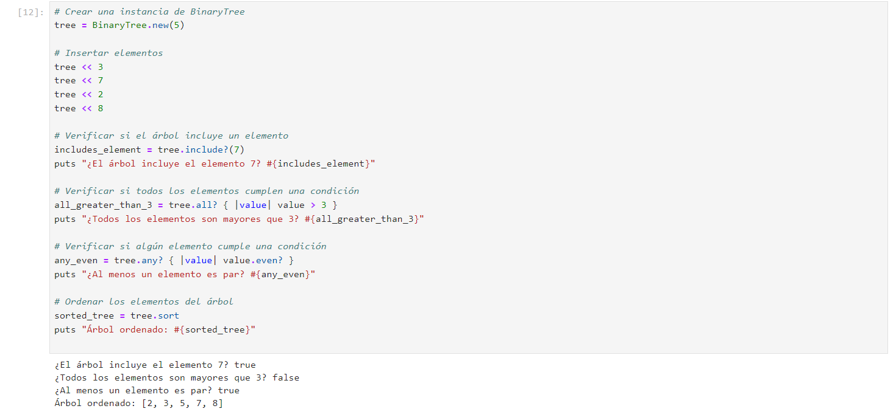

# **Parte 2: **

# **Parte 3: Rail**
Primero, optamos por verificar si las configuraciones de nuestro entorno son las adecuadas para poder realizar sta actividad:
Tuvimos un inconveniente con la versión de nuestro Bundler ya que tenemos una versión de 2.4.20 y se requeria una version >=1.17 y <2.0. 


Por ende ejecutamos el comando 

```
gem install bundler --version=1.17.3
```

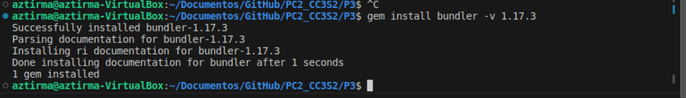

Al realizar la instalación de esta versión de bundle, se tuvo los siguientes inconvenientes 


El error que se obtuvo fue por no configurar bien el archivo gemfile, una vez configurado correctamente nuestro entorno se procede a continuar con el desplegue de la aplicación: 


## Creación una nueva aplicación Rails

Creamos una nueva aplicación Rails llamada "rottenpotatoes" con el comando: 

```
rails new rottenpotatoes --skip-test-unit --skip-turbolinks --skip-spring
```

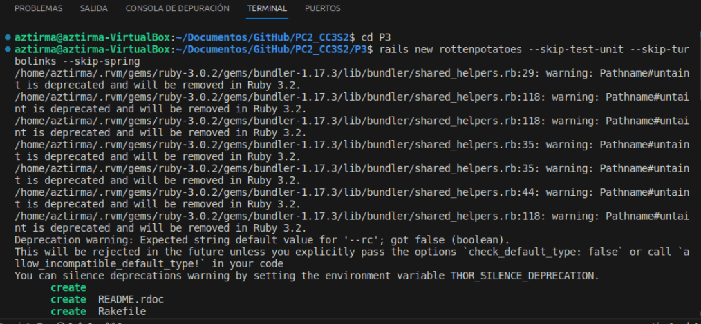

Durante la ejecución de este comando, vimos varios mensajes sobre la creación de archivos y finalizará con "run bundle install". Esto instalará las gemas especificadas en el archivo Gemfile. Esto se muestra a continuación:


Una vez que se completamos la instalación de las gemas, cambiamos al directorio de nuestra nueva aplicación "rottenpotatoes" con el siguiente comando:

```
cd rottenpotatoes
```

**¿Qué pasa con ese mensaje run bundle install?**

Para poder responder esta pregunta, procedemos a ejecutar el comando mencionado.

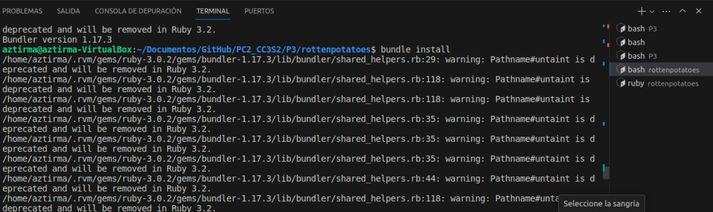

Al ejecutsr este comando, nos informa que hemos completado la instalación de nuestras gemas. Hemos agregado un total de 63 gemas a nuestro proyecto, y estas gemas satisfacen las dependencias que hemos especificado en nuestro archivo Gemfile.


Continuando, nos mencionan que Rails utiliza la base de datos SQLite3 como predeterminada para el desarrollo y las pruebas, nos pide que en nuestro archivo gemfile especifiquemos la version con la que trabajaremos en SQLite3, en este caso 

```
gema 'sqlite3', '~> 1.3.0'
```

Después de realizar estos cambios en el Gemfile, guardamos el archivo y ejecutamos el siguiente comando para actualizar las gemas:

```
bundle update
```
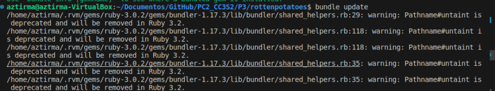


Tenemos que asegurarnos que la salida contenga líneas como "Fetching sqlite3 1.3.x" e "Installing sqlite3 1.3.x", donde "x" es cualquier versión menor.
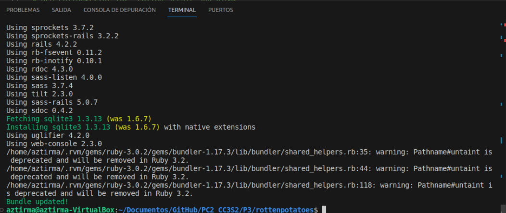

Para verificar que todo funciona correctamente, iniciamos la aplicación localmente ejecutando el siguiente comando en la terminal:

```
rails server
```
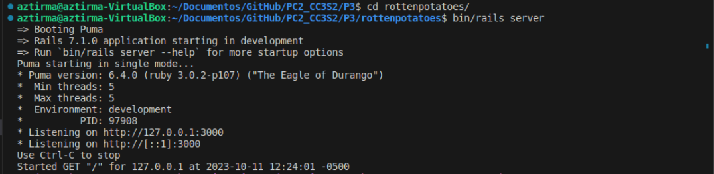

Abrimos nuestro navegador web y visitamos  la página de inicio de la aplicación en localhost:3000. 

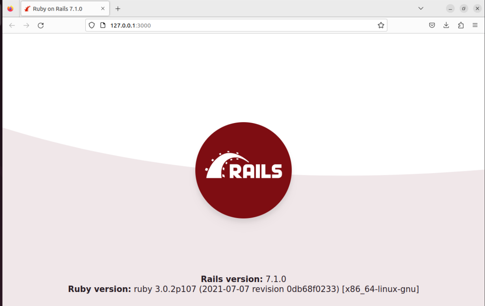

Se puede observar la página de inicio genérica de Ruby on Rails, con esto hemos iniciado correctamente nuestra aplicación localmente.

### Base de datos en diferentes entornos
En esta sección nos indica que Rails define tres entornos (production, development y test) para gestionar bases de datos separadas y evitar que errores en el código afecten accidentalmente la base de datos de producción.
### Crear la base de datos
En esta sección nos indica que al momento de crear una aplicación Rails, debemos crear una base de datos de desarrollo mediante migraciones para garantizar la consistencia y repetibilidad de los cambios en la estructura de la base de datos en todos los entornos.

### Crear y aplicar la migración
Para crear una migración y aplicarla en nuestra  aplicación Rails para agregar una nueva tabla, seguimos los siguientes  estos pasos:

Creamos una migración que describe los cambios que queremos realizar en la base de datos. En este caso, estamos creando una tabla llamada "movies" para almacenar información sobre las películas. Ejecutamos el siguiente comando para generar una migración llamada "create_movies":

```
rails generate migration create_movies
```
Esto generará un archivo en el directorio db/migrate con un nombre que comienza con la fecha y hora de creación y termina con "create_movies.rb". 

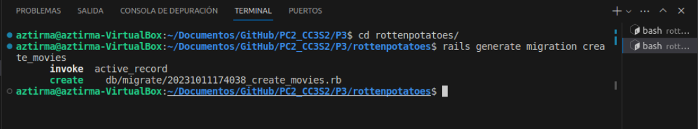

Buscamos el archivo en nuestro directorio y lo abrimos, el cual tiene la siguiente estructura: 

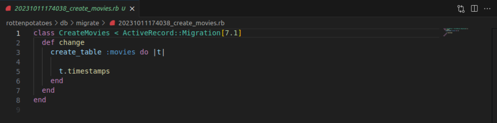

Completamos el codigo con las lineas proporcionadas y lo guardamos. Este código define una migración que crea la tabla "movies" con columnas para el título, la calificación, la descripción y la fecha de lanzamiento de las películas.


Ahora, aplicamos la migración a la base de datos de desarrollo ejecutando el siguiente comando:
```
rails db:migrate
```
Esto ejecutará la migración y creará la tabla "movies" en la base de datos de desarrollo.


No salio esto porque al usar una version de rails 7.1.0 y la migración no está utilizando la sintaxis.

Una vez corregido ese error, vemos que esto ejecutará la migración y creará la tabla "movies" en la base de datos de desarrollo.

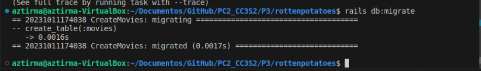

Para asegurarnos de que la base de datos de prueba refleje los cambios en el esquema, ejecutamos el siguiente comando:

```
rails db:test:prepare
```
Esto actualizará la base de datos de prueba para que coincida con la estructura de la base de datos de desarrollo.

### Crea el modelo inicial e inicializa la base de datos
Creamos el modelo ActiveRecord para la tabla "movies", para esto creamos un archivo app/models/movie.rb con estas dos lineas.
```ruby
class Movie < ActiveRecord::Base
end
```
 Esta definición del modelo es suficiente para indicar a Rails que estamos trabajando con la tabla "movies" en la base de datos.

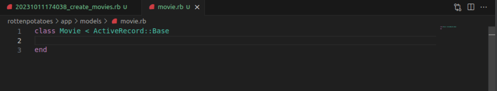
 Para verificar que el modelo "Movie" está definido correctamente, abrimos la consola de Rails ejecutando el siguiente comando:

```
rails console
```
Una vez en la consola, simplemente escribimos Movie.new. Esto debería crear una nueva instancia de la clase Movie con atributos nulos.


Luego, intentamos ejecutar Movie.first para verificar si hay películas en la base de datos. Como aún no hemos agregado ninguna película, esto debería devolver "nil".

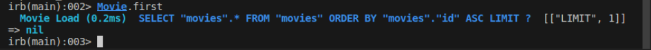

Para agregar datos iniciales a la base de datos, copiamos el código que nos proporciona la actividad en el archivo db/seeds.rb. Este código agrega películas a la base de datos utilizando el modelo "Movie".  

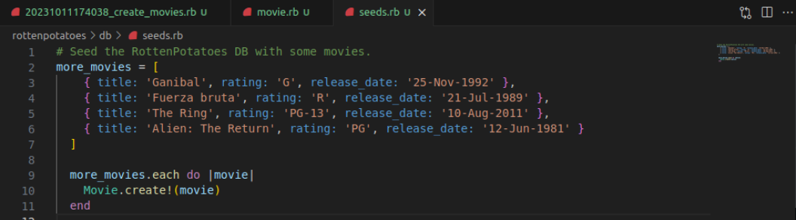

Después de agregar los datos iniciales a db/seeds.rb, ejecutamos el siguiente comando para llenar la base de datos con estos datos:

```
rake db:seed
```
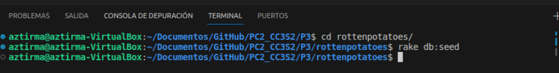

Ahora, podemos volver a la consola Rails ejecutando rails console y ejecutar Movie.first para verificar que las películas se han agregado correctamente a la base de datos. 


## Crear rutas, acciones y vistas CRUD para películas
 Ejecutamos la aplicación nuevamente (como se explicó en la Parte 1) y, en lugar de visitar la página de inicio, intentamos visitar /movies.  
 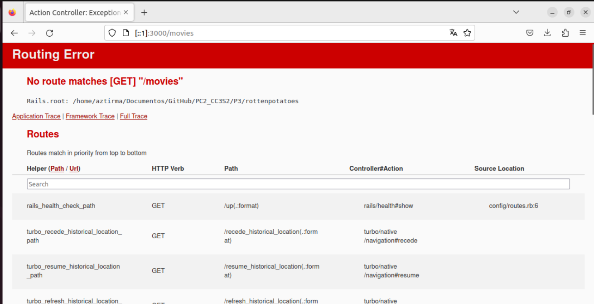

 Verificamos que la aplicación informa que no hay rutas en nuestra nueva aplicación.Esto ocurre debido a que no hemos indicado en el programa qué contenido debe mostrarse cuando accedemos a la ruta /movies. Para solucionar este problema, configuraremos las rutas en el archivo config/routes de nuestra aplicación.

### Crear rutas CRUD


 Editamos el archivo config/routes.rb. Reemplazamos el contenido del archivo routes.rb con el siguiente código y lo guardamos.

 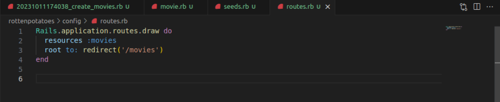
 
 Esto configura rutas RESTful para las cuatro acciones CRUD básicas en el modelo de películas. También redirige la ruta raíz ("/") a la página principal de listado de películas.

Ejecutamos rails routes para verificar que la ruta GET /movies llamará a la acción index del controlador MoviesController.

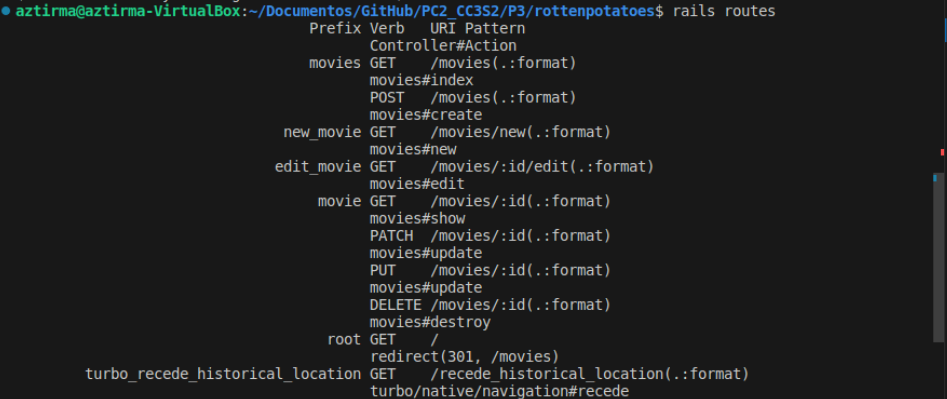

Recargamos la página en el navegador y deberíamos ver un error diferente que indica que la constante MoviesController no está inicializada. Esto es una buena señal, ya que significa que nuestra ruta está funcionando, pero necesitamos definir el controlador.

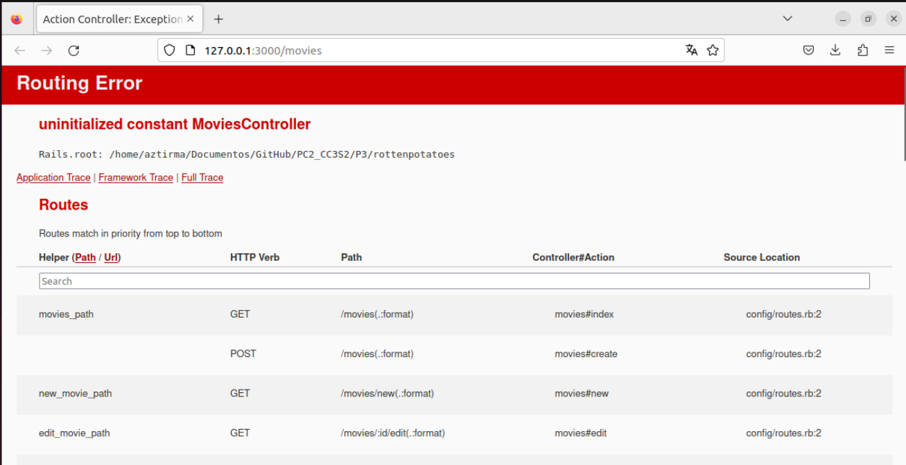

Para crear tanto el archivo del controlador como las vistas asociadas, ejecutamos el siguiente comando:


```
rails generate scaffold_controller Movie title rating description release_date --skip-test

```

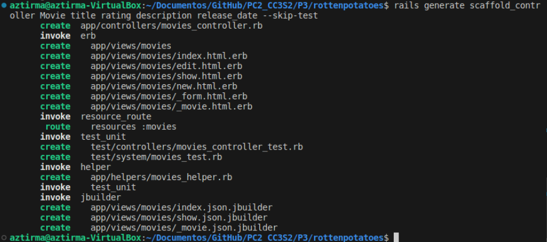

Este comando generará el controlador MoviesController con acciones CRUD y las vistas asociadas para el modelo Movie.

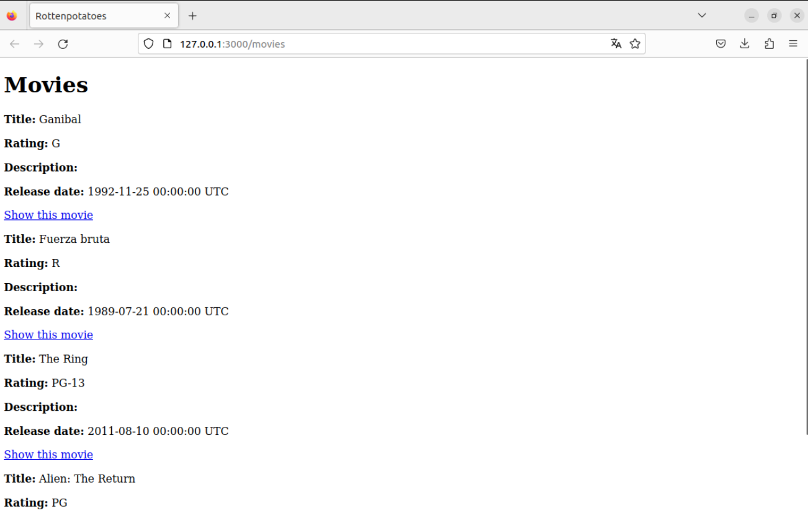

Ahora tenemos una aplicación que funciona. Finalmente, una vez que la aplicación esté funcionando, podemos considerar implementarla en producción.

### Cambiar la base de datos para producción.

Abrimos nuestro archivo Gemfile y agregamos las siguientes líneas en nuestro Gemfile, bajo el grupo de producción:

```
group :production do
  gem 'pg', '~> 0.21' # Heroku deployment
  gem 'rails_12factor'
end
```

Luego, buscamos la línea que especifica la gema 'sqlite3' en nuestro Gemfile y la movemos al grupo de desarrollo y prueba de esta manera:

```
group :development, :test do
  gem 'sqlite3', '~> 1.3.0'
end
```
