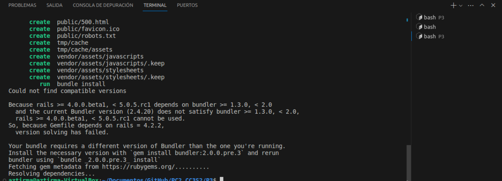
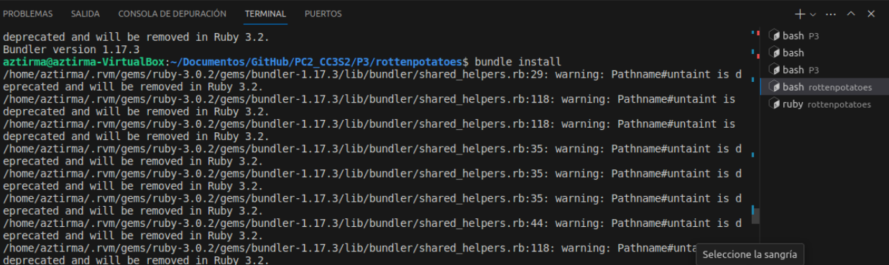
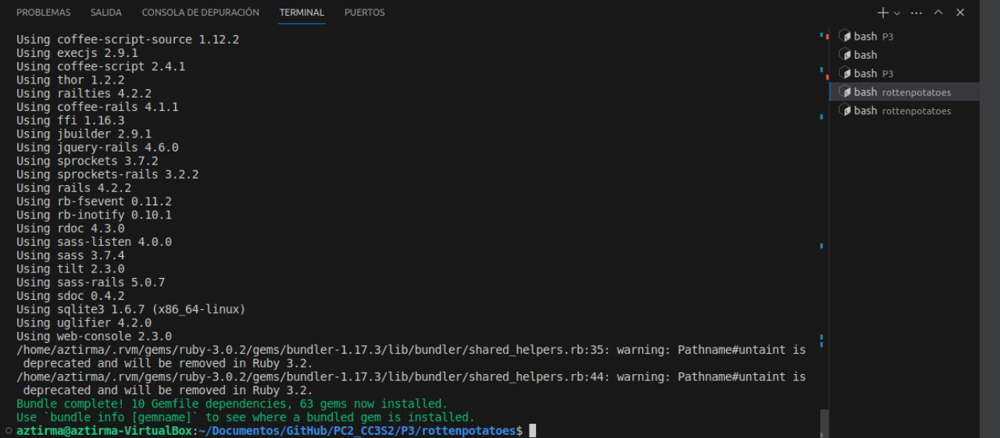
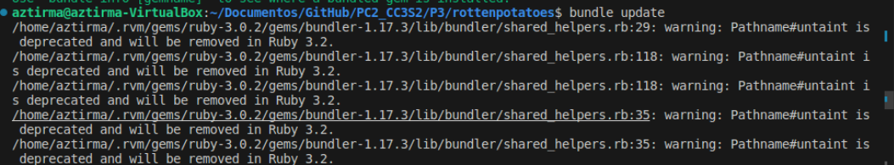
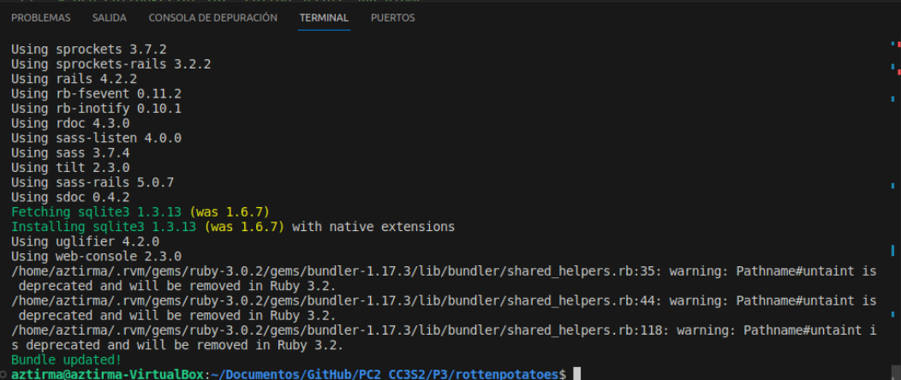
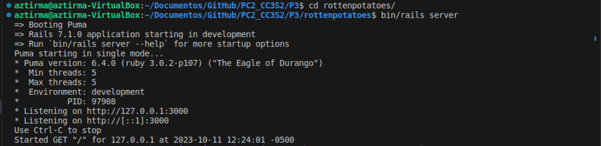
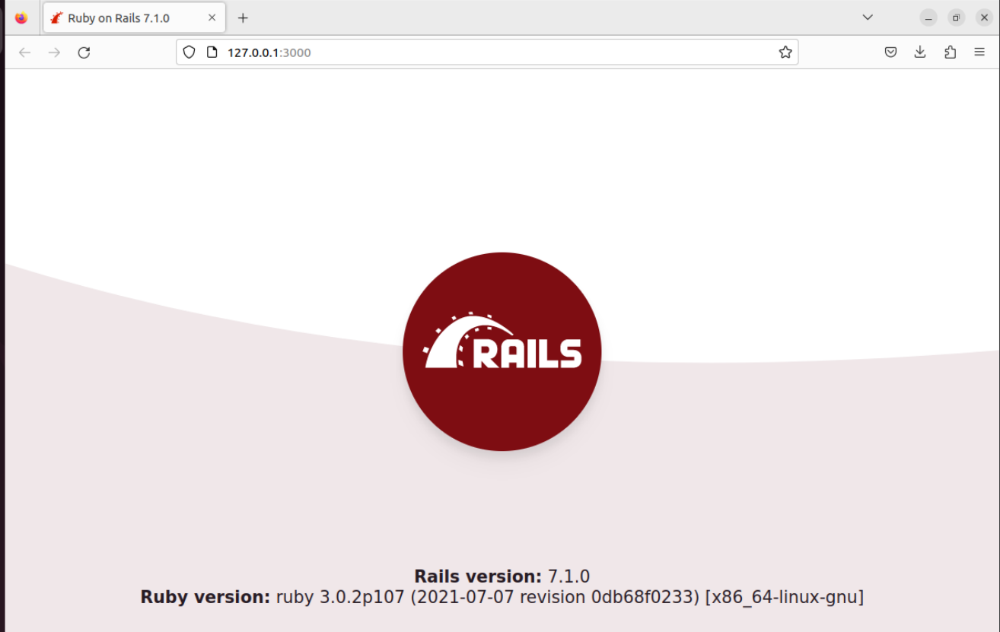
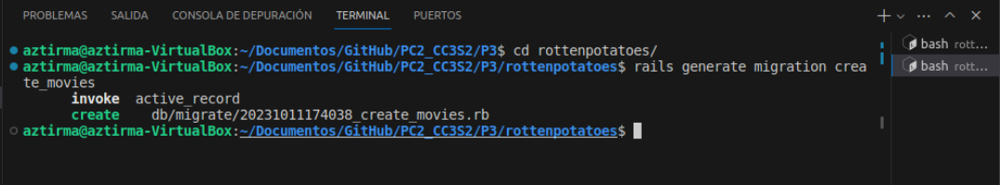
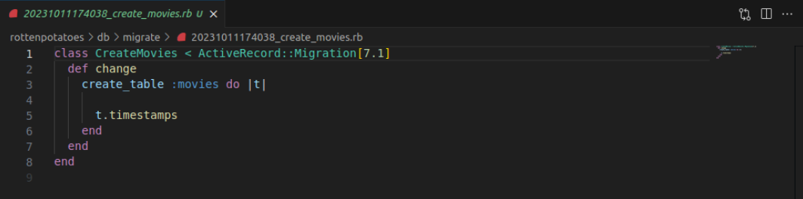
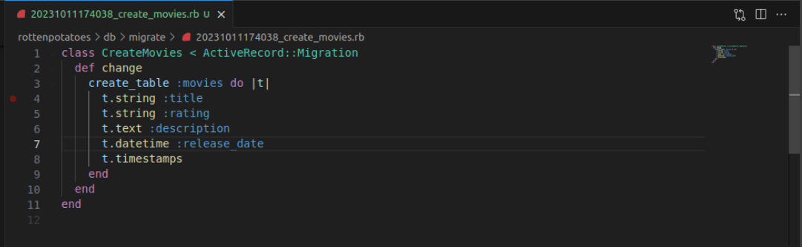

# Práctica Calificada 2
# **Parte 1: Algoritmos, Programación Orientada a Objetos**

1. Nos piden escribir una función que acepte una cadena que contenga todas las letras del alfabeto excepto una y devuelva la letra que falta.

    Implementamos la función find_missing_letter, como se nos pidio está función acepta la cadena con los requisitos requeridos.

    Parametros:
        - str: La cadena de entrada que falta una letra del alfabeto.
    Devuelve:
        - La letra que falta en la cadena.

    Ejemplo de uso:  
        `find_missing_letter` ("the quick brown box jumps over a lazy dog")  
        Devuelve "f"
    
    Realizamos nuestro código ruby en Jupyter Notebook y se puede observar que muestra la salida esperada.

    

2. Nos piden definir una clase colección llamada BinaryTree que ofrezca los métodos de
instancia <<, empty? y each.

    - <<(element): Inserta un elemento en el árbol.
    - empty?: Verifica si el árbol está vacío.
    - each(&block): Realiza un recorrido inorden del árbol.

    *Ejemplo de uso:*   
    tree = BinaryTree.new(5)  
    tree << 3  
    tree << 7  
    tree.empty? # Devuelve false  

    Realizamos nuestro código ruby en Jupyter Notebook como se muestra a continuación, al ejecutarlo nos devuelve each?

    

    Ahora escribimos el ejemplo de uso para comprobar si la función esta bien implementada, podemos observar que nos devuelve false, esto debido a que nuestro arbol no está vacio. 

    

3. Nos piden extender nuestra clase BinaryTree para que ofrezca los siguientes métodos. 

    La clase BinaryTree se ha extendido con los siguientes métodos:
    - include?(elt): Verifica si el árbol incluye un elemento dado.
    - all?(&block): Verifica si un bloque es cierto para todos los elementos del árbol.
    - any?(&block): Verifica si un bloque es cierto para al menos un elemento del árbol.
    - sort: Ordena los elementos del árbol.

    *Ejemplo de uso:*  
    tree.include?(3) # Devuelve true  
    tree.all? { |value| value < 10 } # Devuelve true  
    tree.any? { |value| value > 10 } # Devuelve false  
    tree.sort # Devuelve [3, 5, 7]
    
    Realizamos nuestro código ruby en Jupyter Notebook como se muestra a continuación

    

    Ahora escribimos el ejemplo de uso y lo ejecutamos, observamos que los resultados demuestran el funcionamiento de las funciones de la clase BinaryTree.

    

# **Parte 2: **

# **Parte 3: Rail**
Primero, optamos por verificar si las configuraciones de nuestro entorno son las adecuadas para poder realizar sta actividad:
Tuvimos un inconveniente con la versión de nuestro Bundler ya que tenemos una versión de 2.4.20 y se requeria una version >=1.17 y <2.0. 


Por ende ejecutamos el comando 

```
gem install bundler --version=1.17.3
```


Al realizar la instalación de esta versión de bundle, se tuvo los siguientes inconvenientes 


El error que se obtuvo fue por no configurar bien el archivo gemfile, una vez configurado correctamente nuestro entorno se procede a continuar con el desplegue de la aplicación: 


### Creación una nueva aplicación Rails

Creamos una nueva aplicación Rails llamada "rottenpotatoes" con el comando: 

```
rails new rottenpotatoes --skip-test-unit --skip-turbolinks --skip-spring
```


Durante la ejecución de este comando, vimos varios mensajes sobre la creación de archivos y finalizará con "run bundle install". Esto instalará las gemas especificadas en el archivo Gemfile. Esto se muestra a continuación:



Una vez que se completamos la instalación de las gemas, cambiamos al directorio de nuestra nueva aplicación "rottenpotatoes" con el siguiente comando:

```
cd rottenpotatoes
```

**¿Qué pasa con ese mensaje run bundle install?**

Para poder responder esta pregunta, procedemos a ejecutar el comando mencionado.



Al ejecutsr este comando, nos informa que hemos completado la instalación de nuestras gemas. Hemos agregado un total de 63 gemas a nuestro proyecto, y estas gemas satisfacen las dependencias que hemos especificado en nuestro archivo Gemfile.



Continuando, nos mencionan que Rails utiliza la base de datos SQLite3 como predeterminada para el desarrollo y las pruebas, nos pide que en nuestro archivo gemfile especifiquemos la version con la que trabajaremos en SQLite3, en este caso 

```
gema 'sqlite3', '~> 1.3.0'
```

Después de realizar estos cambios en el Gemfile, guardamos el archivo y ejecutamos el siguiente comando para actualizar las gemas:

```
bundle update
```



Tenemos que asegurarnos que la salida contenga líneas como "Fetching sqlite3 1.3.x" e "Installing sqlite3 1.3.x", donde "x" es cualquier versión menor.


Para verificar que todo funciona correctamente, iniciamos la aplicación localmente ejecutando el siguiente comando en la terminal:

```
rails server
```


Abrimos nuestro navegador web y visitamos  la página de inicio de la aplicación en localhost:3000. 



Se puede observar la página de inicio genérica de Ruby on Rails, con esto hemos iniciado correctamente nuestra aplicación localmente.

### Base de datos en diferentes entornos
En esta sección nos indica que Rails define tres entornos (production, development y test) para gestionar bases de datos separadas y evitar que errores en el código afecten accidentalmente la base de datos de producción.
### Crear la base de datos
En esta sección nos indica que al momento de crear una aplicación Rails, debemos crear una base de datos de desarrollo mediante migraciones para garantizar la consistencia y repetibilidad de los cambios en la estructura de la base de datos en todos los entornos.

### Crear y aplicar la migración
Para crear una migración y aplicarla en nuestra  aplicación Rails para agregar una nueva tabla, seguimos los siguientes  estos pasos:

Creamos una migración que describe los cambios que queremos realizar en la base de datos. En este caso, estamos creando una tabla llamada "movies" para almacenar información sobre las películas. Ejecutamos el siguiente comando para generar una migración llamada "create_movies":

```
rails generate migration create_movies
```
Esto generará un archivo en el directorio db/migrate con un nombre que comienza con la fecha y hora de creación y termina con "create_movies.rb". 



Buscamos el archivo en nuestro directorio y lo abrimos, el cual tiene la siguiente estructura: 



Completamos el codigo con las lineas proporcionadas y lo guardamos. Este código define una migración que crea la tabla "movies" con columnas para el título, la calificación, la descripción y la fecha de lanzamiento de las películas.



Ahora, aplicamos la migración a la base de datos de desarrollo ejecutando el siguiente comando:
```
rails db:migrate
```