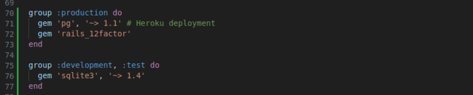
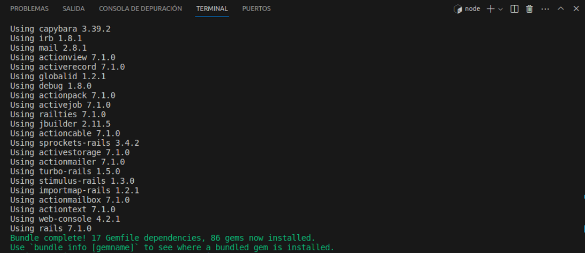

# Práctica Calificada 2
# **Parte 1: Algoritmos, Programación Orientada a Objetos**

1. Nos piden escribir una función que acepte una cadena que contenga todas las letras del alfabeto excepto una y devuelva la letra que falta.

    Implementamos la función find_missing_letter, como se nos pidio está función acepta la cadena con los requisitos requeridos.

    Parametros:
        - str: La cadena de entrada que falta una letra del alfabeto.
    Devuelve:
        - La letra que falta en la cadena.

    Ejemplo de uso:  
        `find_missing_letter` ("the quick brown box jumps over a lazy dog")  
        Devuelve "f"
    
    Realizamos nuestro código ruby en Jupyter Notebook y se puede observar que muestra la salida esperada.

    

2. Nos piden definir una clase colección llamada BinaryTree que ofrezca los métodos de
instancia <<, empty? y each.

    - <<(element): Inserta un elemento en el árbol.
    - empty?: Verifica si el árbol está vacío.
    - each(&block): Realiza un recorrido inorden del árbol.

    *Ejemplo de uso:*   
    tree = BinaryTree.new(5)  
    tree << 3  
    tree << 7  
    tree.empty? # Devuelve false  

    Realizamos nuestro código ruby en Jupyter Notebook como se muestra a continuación, al ejecutarlo nos devuelve each?

    

    Ahora escribimos el ejemplo de uso para comprobar si la función esta bien implementada, podemos observar que nos devuelve false, esto debido a que nuestro arbol no está vacio. 

    

3. Nos piden extender nuestra clase BinaryTree para que ofrezca los siguientes métodos. 

    La clase BinaryTree se ha extendido con los siguientes métodos:
    - include?(elt): Verifica si el árbol incluye un elemento dado.
    - all?(&block): Verifica si un bloque es cierto para todos los elementos del árbol.
    - any?(&block): Verifica si un bloque es cierto para al menos un elemento del árbol.
    - sort: Ordena los elementos del árbol.

    *Ejemplo de uso:*  
    tree.include?(3) # Devuelve true  
    tree.all? { |value| value < 10 } # Devuelve true  
    tree.any? { |value| value > 10 } # Devuelve false  
    tree.sort # Devuelve [3, 5, 7]
    
    Realizamos nuestro código ruby en Jupyter Notebook como se muestra a continuación

    

    Ahora escribimos el ejemplo de uso y lo ejecutamos, observamos que los resultados demuestran el funcionamiento de las funciones de la clase BinaryTree.

    

# **Parte 2: **

# **Parte 3: Rail**
Primero, optamos por verificar si las configuraciones de nuestro entorno son las adecuadas para poder realizar sta actividad:
Tuvimos un inconveniente con la versión de nuestro Bundler ya que tenemos una versión de 2.4.20 y se requeria una version >=1.17 y <2.0. 


Por ende ejecutamos el comando 

```
gem install bundler --version=1.17.3
```


Al realizar la instalación de esta versión de bundle, se tuvo los siguientes inconvenientes 


El error que se obtuvo fue por no configurar bien el archivo gemfile, una vez configurado correctamente nuestro entorno se procede a continuar con el desplegue de la aplicación: 



### Creación una nueva aplicación Rails

Creamos una nueva aplicación Rails con el comando: 
```
rails new rottenpotatoes --skip-test-unit --skip-turbolinks --skip-spring
```


